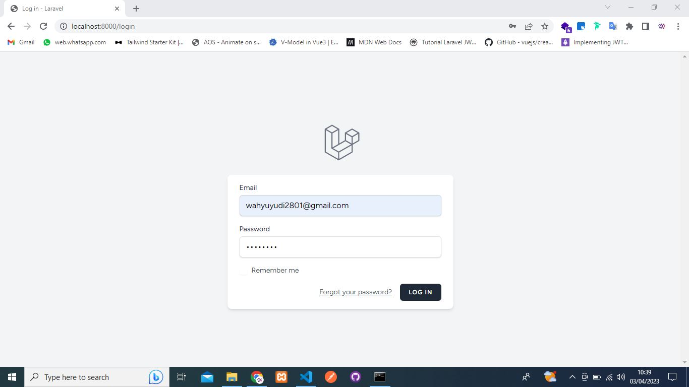
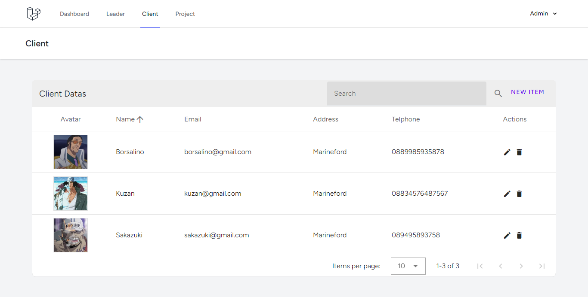

# E-Monitoring Web Application
## Pages & Fiturs
* Login
* Dashboard
* Leader page
    * CRUD
    * Pagination
    * Searching
    * Sorting
* Client page
    * CRUD
    * Pagination
    * Searching
    * Sorting
* Project Monitoring page
    * CRUD
    * Pagination
    * Searching
    * Sorting
    * Show detail
* Detail project page
    * show detail project
    * update progress

## Review Application
### Login

Pertama-tama login terlebih dahulu, untuk email dan passwordnya adalah:

Email: wahyuyudi2801@gmail.com

Password: admin123

### Dashboard

Setelah berhasil login, nanti akan otomatis diarahkan ke halaman dashboard. Di halaman dashboard menampilkan jumlah data pada masing-masing halaman.

### Leader

Halaman leader akan menampilkan data leader project dan juga bisa memanipulasi datanya seperti create, update, dan delete.
#### Create data

Klik tombol New Item, maka akan muncul sebuah form modal.

Isi form dengan benar. Lalu klik tombol save.

Maka data akan disimpan dan ditampilkan di dalam tabel.

#### Update data

Klik icon pensil pada data yang sudah dibuat tadi. Maka akan muncul sebuah form edit.

Update data yang ingin di-update(disini saya menghapus avatar dan mengubah nama). Lalu klik tombol save.

Data berhasil diperbarui.

#### Delete data

Klik icon tong sampah pada data yang tadi. Maka akan muncul konfirmasi hapus. Klik "OK" untuk menghapus atau klik "Cancel" untuk batal hapus.

Jika klik "OK" maka data berhasil dihapus.

### Client

Halaman client akan menampilkan data client project dan juga bisa memanipulasi datanya seperti create, update, dan delete.

#### Create data

Klik tombol new item.

Isi form.

Disini saya mendapat error validation, karena pada form email saya menginputkan data yang tidak sesuai dengan format email.

Perbaiki data di dalam form email dengan benar.

Data berhasil ditambahkan!

#### Update data

Klik salah satu icon pencil.

Ubah datanya.

Data berhasil diperbarui.

#### Delete data

Klik salah satu icon trash untuk menghapus data yang diinginkan.

Klik "OK", dan data berhasil dihapus.

### Project Monitoring

Halaman utama.

#### Create data

Klik tombol New Item.

Isi data dengan benar.

Data project baru berhasil ditambah.

#### Update data

Klik icon pencil.

Update form data. Dan klik save. Maka data berhasil diperbarui.

Klik icon eye untuk melihat detail dari data. Checklist untuk progress yang sudah selesai dikerjakan. Dan klik save

Jika berhasil maka akan muncul alert data berhasil di-update.

Kembali ke halaman project utama dengan klik Project di navigationnya. Maka progress bar juga sudah diperbarui.
